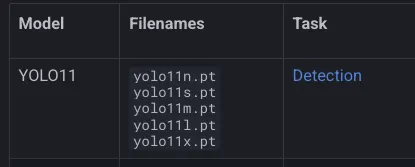
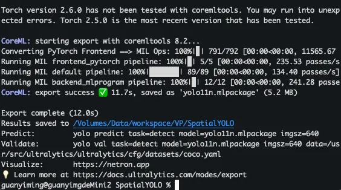
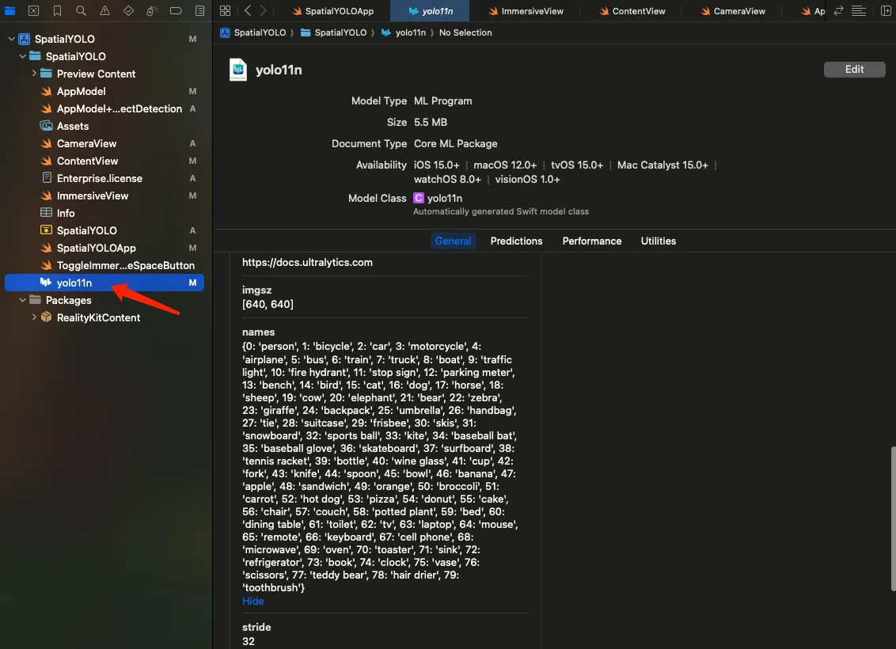
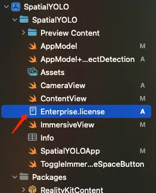
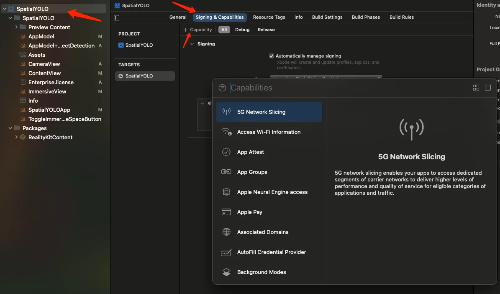
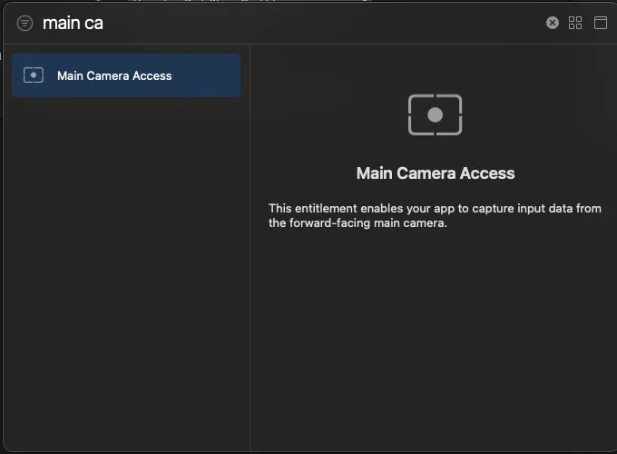
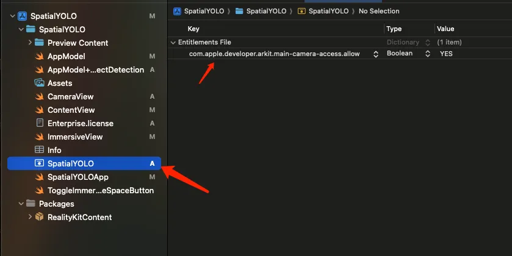
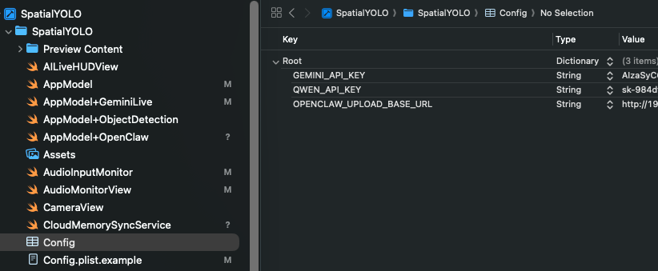

[English](README.md) | [中文](README_zh.md)

# SpatialYOLO

[](https://www.youtube.com/watch?v=loWgQPtxxXs)

[](LICENSE)
[](https://developer.apple.com/visionos/)
[](https://developer.apple.com/xcode/)

Real-time object detection and AI visual assistant on Apple Vision Pro.

- **Spatial YOLO** — Stereo camera + YOLOv11n object detection + stereo depth estimation
- **AI Live** — Interactive AI assistant with real-time video + voice conversation, supports Google Gemini Live and Alibaba Qwen Omni

## I. Generate YOLO Model Supported by CoreML
### 1. Install ultralytics
If you haven't installed the ultralytics library, install it first using the command
```
pip install ultralytics
```
### 2. Select Model


Here we choose yolo11n because it has a small model size and fast speed.
### 3. Export to CoreML Supported Format
```
yolo export model=yolo11n.pt format=coreml nms=true
```

### 4. Add yolo11n.mlpackage to Project


Reference Documentation
https://docs.ultralytics.com/integrations/coreml/

## II. Enterprise Certificate and Capability Settings
### 1. Add Certificate


This certificate is sent by Apple via email after successful enterprise API application
### 2. Set Capability


On the Signing & Capabilities page, click the + Capability button, which will open a search interface. Search for Main Camera Access, then double-click to add it to the project.



After that, an entitlement file with a yellow icon will appear



## III. AI Live API Configuration

### 1. Get API Keys
- **Gemini:** Obtain a Gemini API Key from [Google AI Studio](https://aistudio.google.com/)
- **Qwen:** Obtain a DashScope API Key from [Alibaba Cloud Bailian](https://bailian.console.aliyun.com/)

### 2. Configure API Keys
```bash
# Copy the template config file
cp SpatialYOLO/Config.plist.example SpatialYOLO/Config.plist
```

Edit `SpatialYOLO/Config.plist` and replace `YOUR_API_KEY_HERE` with your actual API Keys:
```xml
<key>GEMINI_API_KEY</key>
<string>your-gemini-api-key</string>
<key>QWEN_API_KEY</key>
<string>your-qwen-api-key</string>
```

### 3. Add Config.plist to Xcode Project
Add `Config.plist` to the Xcode project's target build resources so it can be read at runtime via `Bundle.main`.

> **Note:** `Config.plist` is in `.gitignore` and will not be committed to the repository.



### 4. Supported AI Providers

**Gemini Live** (Google)
- **Model:** `gemini-2.5-flash-native-audio-preview-12-2025` (Native Audio)
- **Session Limit:** ~2 minutes for video + audio sessions

**Qwen Omni** (Alibaba)
- **Model:** `qwen3-omni-flash-realtime`
- **Session Limit:** 120 minutes
- **Server VAD:** Auto-detect speech start/stop
- **Native Chinese:** Reliable audio transcription in Chinese

**Common Features**
- **Real-time Video:** Camera frames sampled at 1fps, JPEG compressed (max 1024px), sent via WebSocket
- **Voice Input:** Microphone audio captured at 16kHz PCM, sent in real-time
- **Audio Response:** AI responds with PCM audio, played through AVAudioEngine
- **Subtitles:** AI response text displayed as typewriter-effect overlay on the video feed
- **Provider Switch:** Toggle between Gemini and Qwen in the control panel

## IV. OpenClaw Shopping Cart Automation (Optional)

OpenClaw is an optional companion feature that lets the AI Live assistant automatically search for and add items to your Taobao shopping cart by analyzing what's visible through the camera.

### How it works

1. The Vision Pro app captures a camera frame and sends it to the **workspace image server** running on your Mac
2. The server receives the image, launches a local Node.js Playwright script to search Taobao by image, and adds the found item to cart
3. Progress is polled in real-time and displayed in the AI Live control panel

### Start the workspace image server (Mac)

```bash
# Install dependencies (first time only)
cd scripts/taobao-image-search
npm install

# Start the server
OPENCLAW_TOKEN=your-token bash scripts/run_openclaw_workspace_image_server.sh
```

The server listens on `http://0.0.0.0:18888` by default.

**Key environment variables:**

| Variable | Default | Description |
|---|---|---|
| `WORKSPACE_IMAGE_SERVER_PORT` | `18888` | HTTP listen port |
| `OPENCLAW_TOKEN` | — | Shared auth token |
| `OPENCLAW_BASE_URL` | `http://127.0.0.1:18789` | OpenClaw gateway URL |
| `OPENCLAW_IMAGE_PATH` | `~/.openclaw/workspace/image.png` | Where uploaded images are saved |
| `TAOBAO_IMAGE_SEARCH_HEADLESS` | `0` | Set to `1` for headless mode |

**Server endpoints:**

| Method | Path | Description |
|---|---|---|
| `GET` | `/health` | Health check |
| `POST` | `/upload-image` | Receive JPEG frame from Vision Pro |
| `POST` | `/tasks/openclaw` | Queue a new shopping cart task |
| `GET` | `/tasks/:id` | Poll task status |

### Configure on Vision Pro side

Add these keys to `SpatialYOLO/Config.plist`:

```xml
<key>OPENCLAW_UPLOAD_BASE_URL</key>
<string>http://your-mac-ip:18888</string>
<key>OPENCLAW_TOKEN</key>
<string>your-token</string>
```

### Taobao login

The script uses a saved Playwright storage state for Taobao login. To save your login state:

```bash
cd scripts/taobao-image-search
node save-taobao-cookie.js
```

Follow the browser prompt to log in to Taobao, then the session will be saved for future runs.

## V. Build & Run

Requirements: Xcode 16.2+, visionOS SDK, Apple Enterprise Certificate (for main camera access).

```bash
# 1. Configure API Keys (see section III)
cp SpatialYOLO/Config.plist.example SpatialYOLO/Config.plist

# 2. Open project in Xcode
open SpatialYOLO.xcodeproj

# 3. Select visionOS device and run
```

## Contributing

Contributions are welcome! Feel free to open issues or pull requests.

## License

This project is licensed under the MIT License — see [LICENSE](LICENSE) for details.
