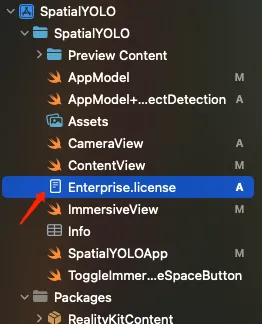
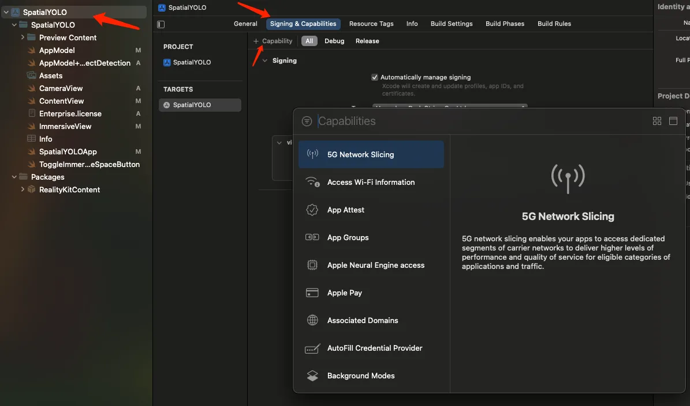

[English](README.md) | [中文](README_zh.md)

## I. Generate YOLO Model Supported by CoreML
### 1. Install ultralytics
If you haven't installed the ultralytics library, install it first using the command
```
pip install ultralytics
```
### 2. Select Model


Here we choose yolo11n because it has a small model size and fast speed.
### 3. Export to CoreML Supported Format
```
yolo export model=yolo11n.pt format=coreml nms=true
```

### 4. Add yolo11n.mlpackage to Project


Reference Documentation
https://docs.ultralytics.com/integrations/coreml/

## II. Enterprise Certificate and Capability Settings
### 1. Add Certificate


This certificate is sent by Apple via email after successful enterprise API application
### 2. Set Capability


On the Signing & Capabilities page, click the + Capability button, which will open a search interface. Search for Main Camera Access, then double-click to add it to the project.


After that, an entitlement file with a yellow icon will appear


