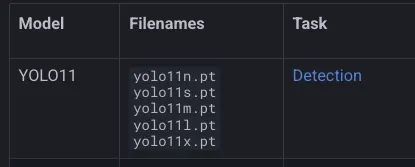
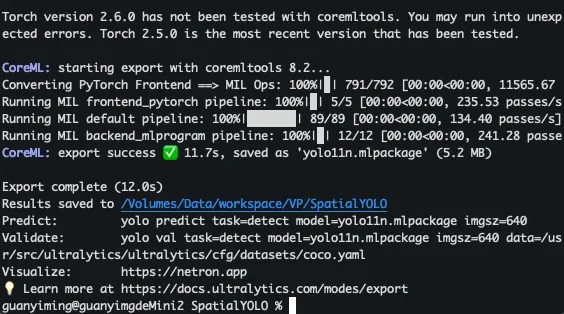
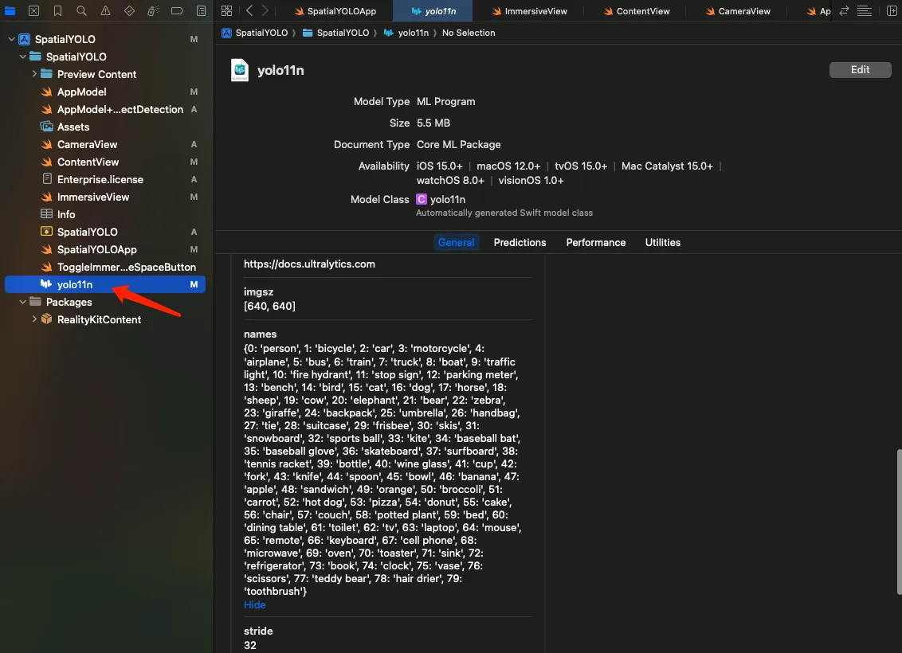
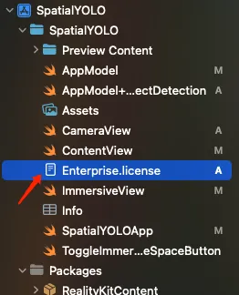
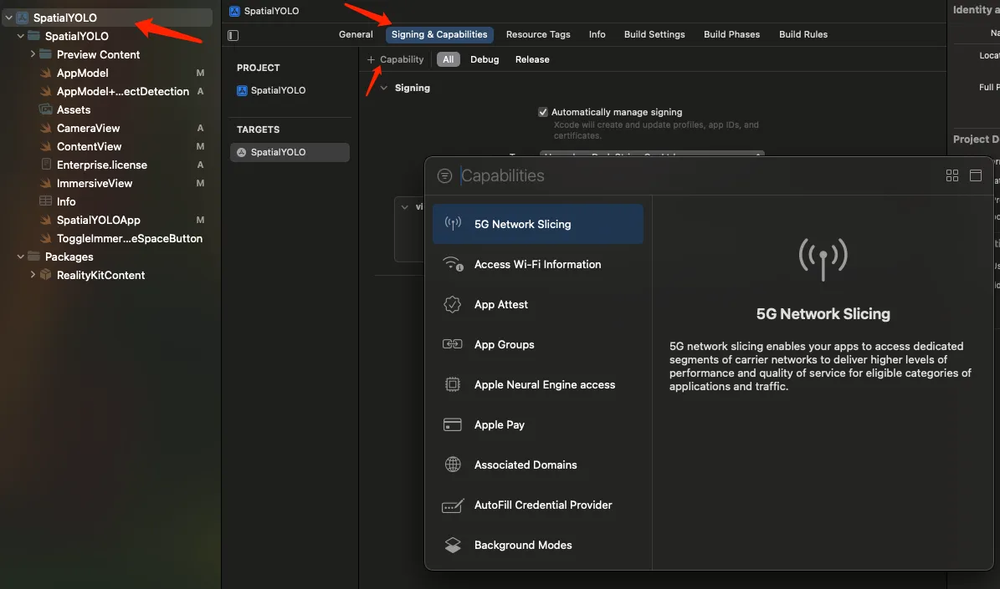
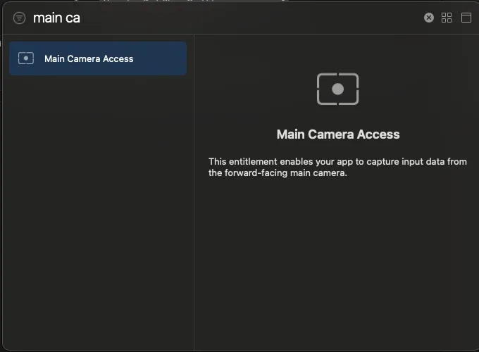
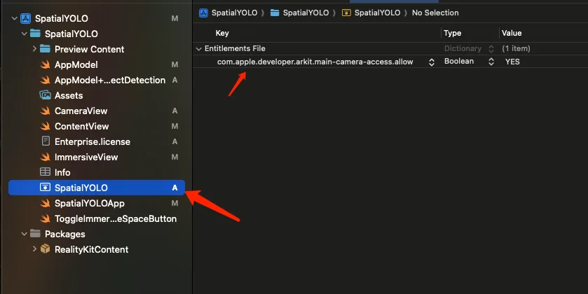

[English](README.md) | [中文](README_zh.md)

## 一、生成coreml支持的Yolo模型
### 1.安装ultralytics
如果没有安装过 ultralytics 库的同学先通过命令安装
```
pip install ultralytics
```
### 2.选择模型


这里我们选择 yolo11n，因为模型体积小速度快。
### 3.导出coreml支持的格式
```
yolo export model=yolo11n.pt format=coreml nms=true
```

### 4.添加yolo11n.mlpackage到项目


参考文档
https://docs.ultralytics.com/integrations/coreml/

## 二、企业证书和Capability设置
### 1.添加证书


这个证书是企业API申请成功之后，苹果通过邮件发送的
### 2.设置Capability


在Signing & Capabilities页面，点击 + Capability 这个按钮，会弹出一个搜索界面，我们搜索 Main Camera Acces，然后双击添加到项目中。



之后就会出现一个黄色图标的entitlement文件

